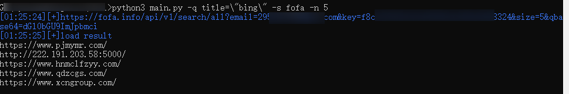

# GUrl
Get urls from fofa,hunter,etc.

### Platform
- [x] windows
- [ ] unix/linux

### Third party lib
- [x] click
- [x] requests  

### API
- [x] fofa
- [x] hunter
- [ ] shodan
- [ ] censys

### Usage

##### config.ini  
```
[fofa]  
apikey = 12412xxxxxxxxxxxx  
email = test@test.com  
```
##### Windows 
python main.py -q title=\"bing\" -s fofa -n 5  


